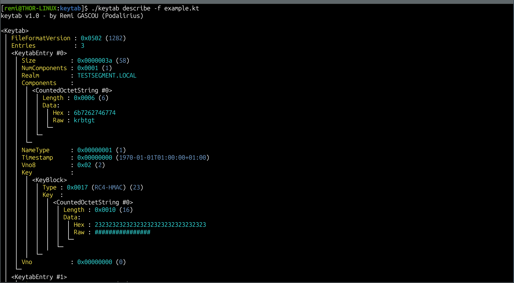

<p align="center">
    keytab, a cross platform tool to work with keytab files used by Kerberos to store authentication information.
    <br>
    
    <a href="https://twitter.com/intent/follow?screen_name=podalirius_" title="Follow"></a>
    <a href="https://www.youtube.com/c/Podalirius_?sub_confirmation=1" title="Subscribe"></a>
    <br>
</p>

## Features

- [x] Read keytab files
- [x] Write keytab files
- [x] Add entries to keytab files
- [x] Remove entries from keytab files
- [x] List entries in keytab files
- [x] Describe keytab entries

## Usage

```
$ ./keytab -h
keytab v1.0 - by Remi GASCOU (Podalirius)

Usage: keytab <mode> [options]

  add        Add a new key to the keytab file.
  delete     Delete a key from the keytab file.
  describe   Describe the content of a keytab file.
  export     Export the keytab file to a file.

```

## Demonstration



## References

- [https://web.mit.edu/kerberos/krb5-1.12/doc/formats/keytab_file_format.html](https://web.mit.edu/kerberos/krb5-1.12/doc/formats/keytab_file_format.html)
- [https://www.gnu.org/software/shishi/manual/html_node/The-Keytab-Binary-File-Format.html](https://www.gnu.org/software/shishi/manual/html_node/The-Keytab-Binary-File-Format.html)
- [https://www.ioplex.com/utilities/keytab.txt](https://www.ioplex.com/utilities/keytab.txt)